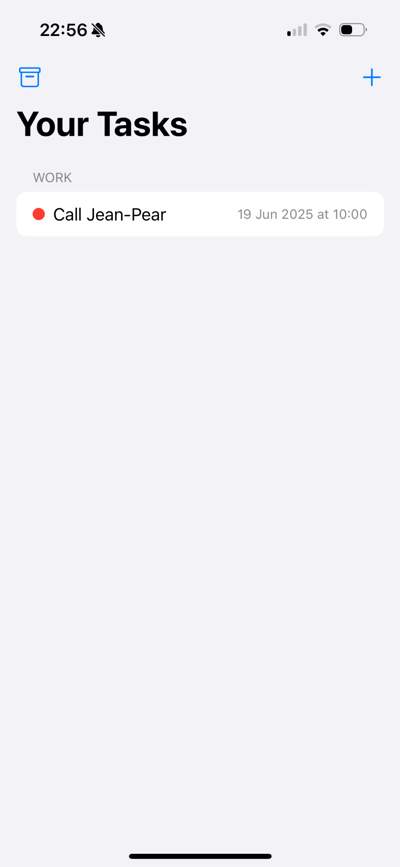
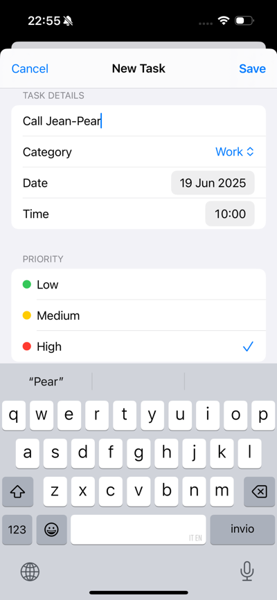
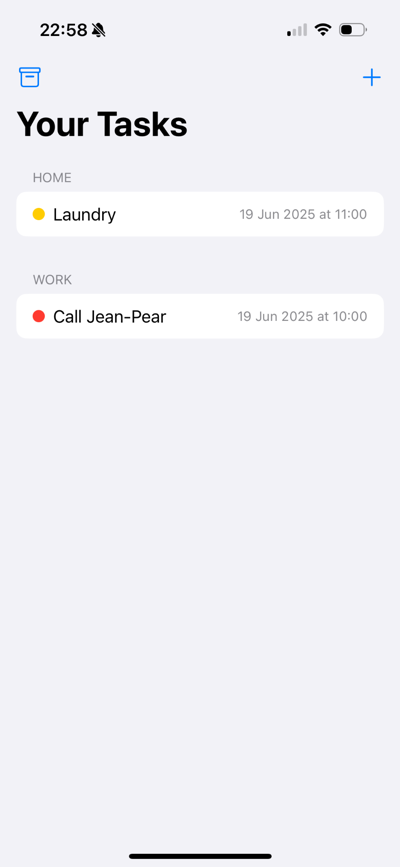

# 🗓️ DailyPlan

**DailyPlan** is a simple and intuitive iOS app designed to help users manage their daily tasks by categorizing them and prioritizing what matters most. Created with a clean SwiftUI interface, it provides an effortless way to plan your day and stay organized.

---

## 🚀 Features

- 📝 Add, edit, and delete tasks
- 🗂️ Organize by category: **Home**, **University**, **Work**
- ⏰ Set specific date and time for each task
- 🔴 Prioritize tasks: Low, Medium, High (color-coded)
- 🌓 Support for light and dark mode
- 💾 Offline persistence via **SwiftData**

---

## 📸 Screenshots






---

## 🛠️ Tech Stack

- **SwiftUI** – declarative UI framework
- **SwiftData** – local storage and persistence
- **MVVM** – architectural pattern
- **Xcode** – development environment

---

## 🔧 Installation

To run the project locally:

1. Clone the repository  
   ```bash
   git clone https://github.com/agambone/DailyPlan.git
   ```
2. Open the project in **Xcode**
3. Build and run on a simulator or iOS device (iOS 17+ recommended)

---

## 🎯 Project Goals

Developed during the **Apple Developer Academy**, DailyPlan aims to combine clean UI/UX design with functional productivity tools. The project demonstrates understanding of:

- SwiftUI layout and logic
- User-centered design
- Task management models
- Agile prototyping and iteration

---

## 👤 Author

**Antonio Gambone**  
[GitHub](https://github.com/agambone) • [LinkedIn](https://www.linkedin.com/in/antonio-gambone/)

---

## 📄 License

This project is licensed under the MIT License – see the [LICENSE](./LICENSE) file for details.
